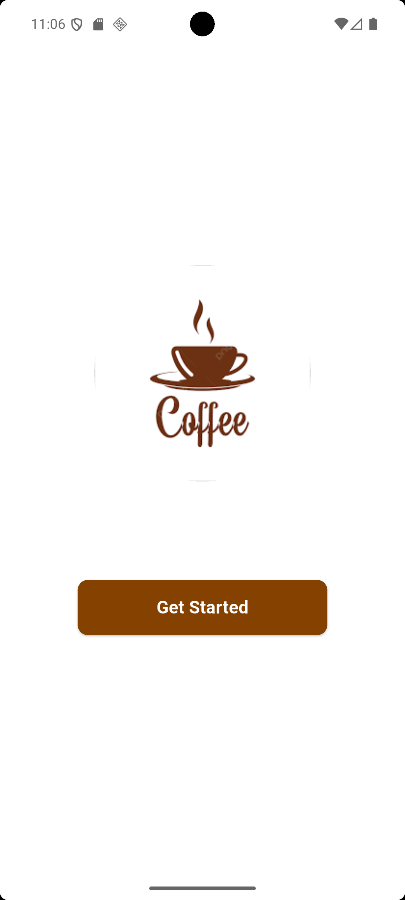
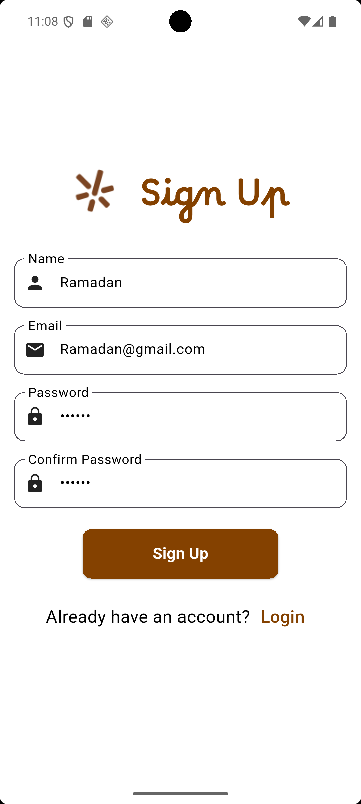
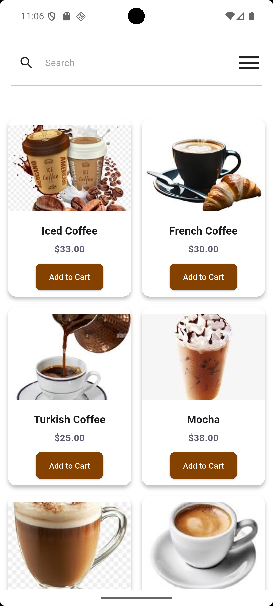
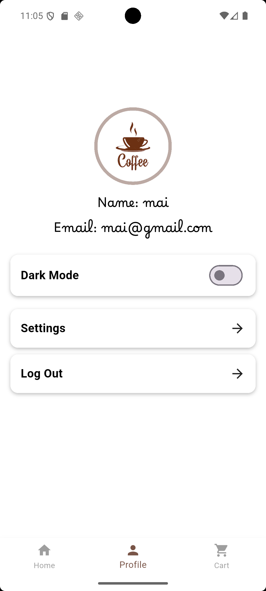
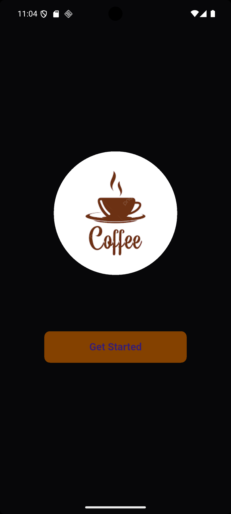
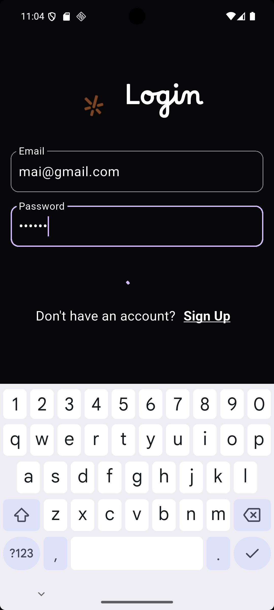
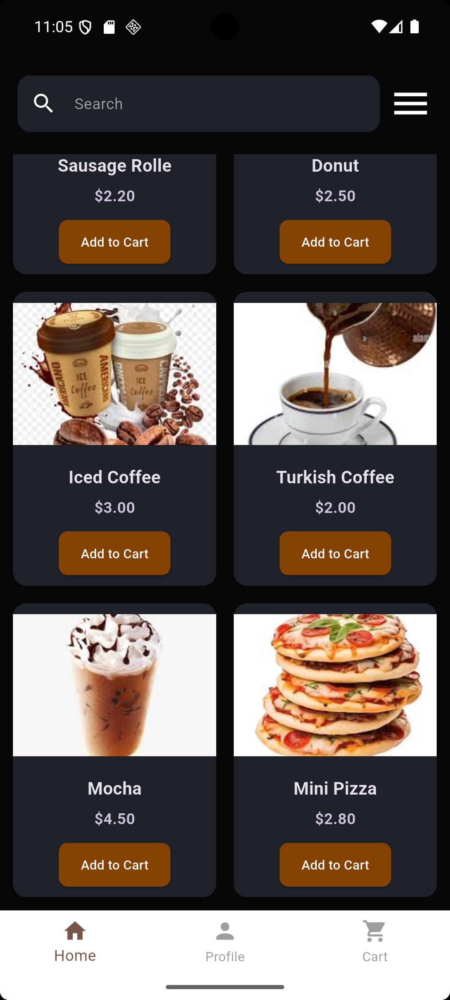
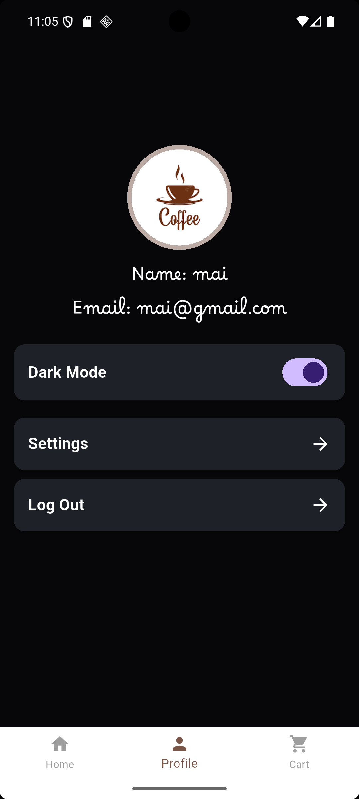

# ☕ Coffee App

Coffee App is a modern Flutter application for managing and purchasing coffee products.  
It provides a sleek and user-friendly interface with support for **Firebase Authentication**, **Cloud Firestore**, and **Dark/Light Theme Switching**.

---

## 🚀 Features  

### Authentication & User Management
- 🔐 **Firebase Authentication**: Sign up and log in using email and password.
- 👤 **User Profile**: View and update user information (name, email, profile picture).

### Product & Search
- 📦 **Product Management**: Display all coffee products stored in Firestore.
- 🔍 **Search Functionality**: Quickly find products by name or category.

### UI & UX
- 🌓 **Dark & Light Mode**: Seamlessly switch between dark and light themes.
- 🎨 **Custom Widgets & UI Components**: Includes `ProfileContainer`, `SmallContainer`, and `AppThemes`.

---

📸 Light App Screenshots  

| GetStarted | SignUp | Home | Coffee Light | Profile Page (Dark Mode) |
|------------|--------|------|--------------|--------------------------|
|  
|  
|  
|  
|  |

📸 Dark App Screenshots  

| GetStarted | Login | Home | Dark Profile |
|------------|-------|------|--------------|
|  
|  
|  
|  |

> *Place your screenshots inside `assets/screenshots/` and update the links above.*

---

## 🎥 Demo Video  

  

> *Replace the link with a video on Google Drive or YouTube showing the app in action.*

---

## 🛠 Tech Stack  

- [Flutter](https://flutter.dev/)  
- [Dart](https://dart.dev/)  
- [Firebase Authentication](https://firebase.google.com/docs/auth)  
- [Cloud Firestore](https://firebase.google.com/docs/firestore)  
- [BLoC State Management](https://bloclibrary.dev/#/)  

-

